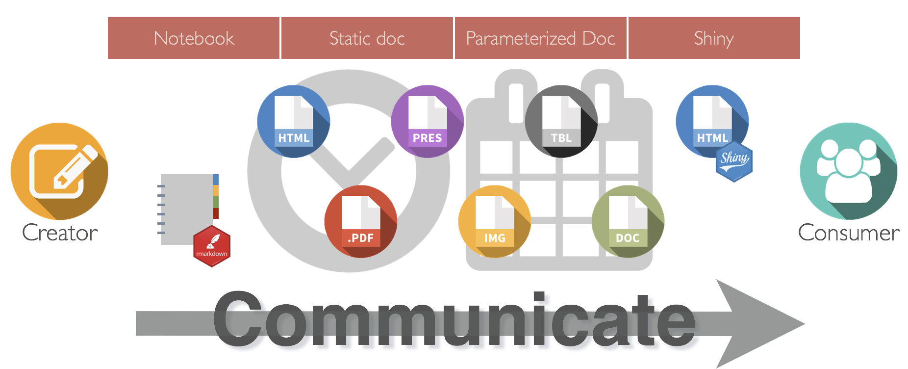
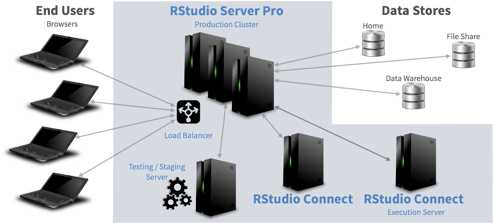
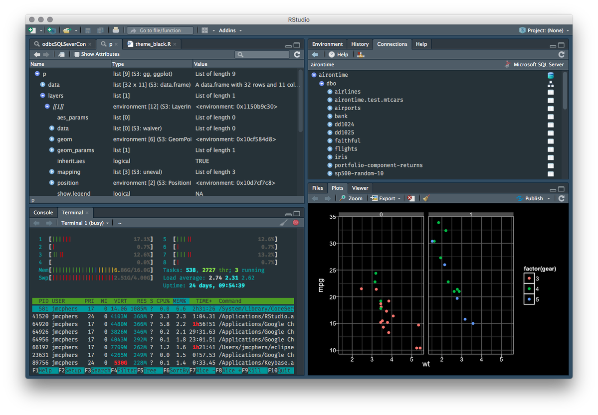
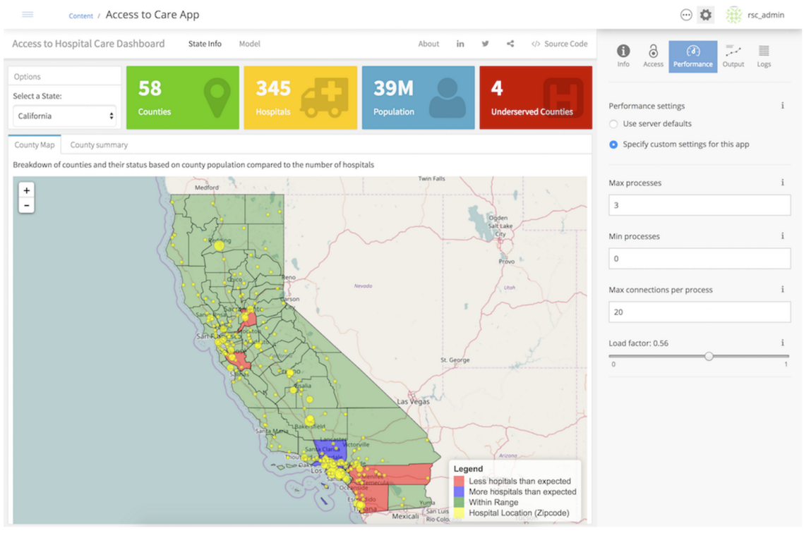
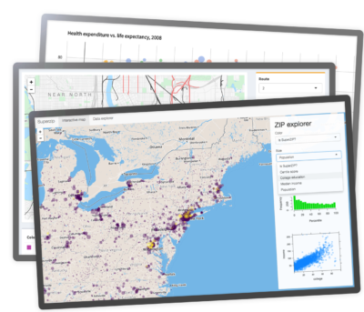
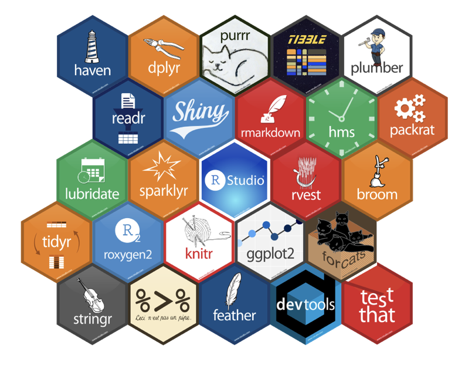
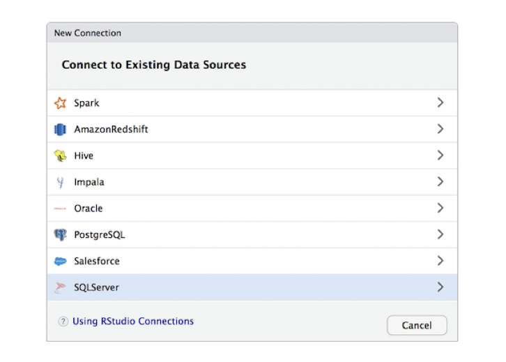
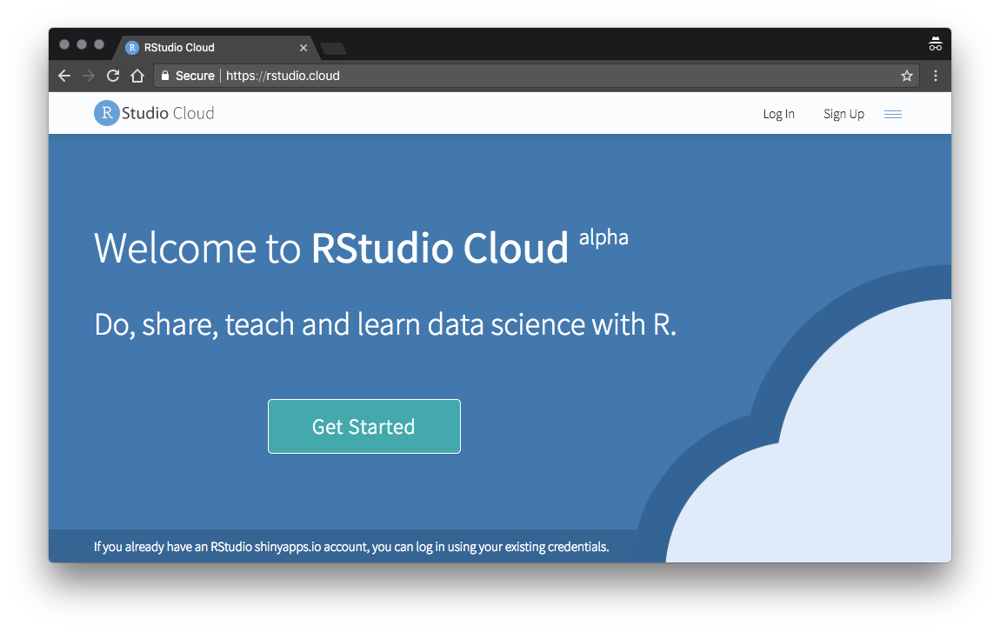

```{r setup, include=FALSE}
#Shortcuts
#c: Create a clone presentation on a new window
#p: Toggle PresenterMode
#f: Toggle Fullscreen

options(htmltools.dir.version = FALSE)
library(ggplot2)
library(dplyr)
library(knitr)
library(kableExtra)

thm <- theme_bw() + 
  theme(
    panel.background = element_rect(fill = "transparent", colour = NA), 
    plot.background = element_rect(fill = "transparent", colour = NA),
    legend.background = element_rect(fill = "transparent", colour = NA),
    legend.key = element_rect(fill = "transparent", colour = NA)
  )
theme_set(thm)
```

class: class: dark-blue, middle

[Speaker("

.name[Tareef Kawaf]

",

title = "President",

company = "RStudio"

)

---
class: class: dark-green, middle

*The primary mission of RStudio is to build a sustainable open-source business that creates software for data science and statistical computing.* 

*Our open source projects are supported by our commercial products that help teams of R users work together effectively, share computing resources, and publish their results to decision makers within the organization.*


???
This is a kinda cool slide to start with

---
class: rstudio-slide, left

# What we do

.large[
- Build and promote software that supports reproducible data analysis
  - Primary focus is usability in our interfaces and APIs
  - Open-source products have become the de facto standards for R statistical programming
- Our tools are not for everyone, but they are  available to everyone (Like R itself)
  - 70% of our engineering effort is towards open source: RStudio, Shiny, R Markdown, dplyr, etc.
  - The essential parts of our stack must be open source
- Achieve a  sustainable business model, primarily from commercially-licensed versions of our servers
  - Helpful features in our Pro products for: Security, Scalability, Manageability, Auditing, Deployment, Collaboration, etc
  - <highlight>If you've licensed our Pro products, thank you for supporting us!</highlight>
]

---
class: rstudio-slide, left

# Our Goals

.left-column[Make R more accessible to a wider audience by making it easier to:
.large[- Learn
- Integrate with enterprise systems
- Operate in enterprise environments
]]

.right-column[]

---
class: rstudio-slide, left

# How we think about Datascience


.pull-right[r4ds.had.co.nz]

---
class: rstudio-slide, left 

# Empowered Analysts



---
class: rstudio-slide, left 

# A Typical Setup




---
class: rstudio-slide, left 

# Integrated Development Environment
.left-column[
Open-Source
- Runs on the Desktop (Windows, OSX, Linux) or over the Web as a server to enable shared resources and collaboration
  - Data viewer -- support large datasets, filtering, searching, sorting
  - Code completion, diagnostics & Customizable code snippets
  - Improved tools for Rcpp
  - Multiple cursors
  - Tab re-ordering & New themes
  - Enhanced Vim mode
  - Notebooks
  - Add-ins
]
.pic-right[]
.right-column[
Pro
- Improved Session Management
- Project Sharing
- Collaborative Editing
- Support for floating licenses
- Updated tools for administrators
]


---
class: rstudio-slide, left 

# RStudio Connect 

.left-column[
- Push-button publishing from the RStudio IDE that manages all the content types you produce in R: Shiny, R Markdown, plots, etc.
- Whats New?
  - REST based APIs using plumber
  - Clustering and execution nodes (includes Postgres support)
  - Retain historical content for scheduled reports
    - Security
    - Kerberos support (run as authenticated shiny viewer)
  - Web sudo mode
  - Supporting Tag hierarchies
  - Content search
]
.pic-right[]
.right-column[
and more...
  - Parameterized report editor
  - Source version roll forward/back
  - Shiny bookmarkable state 
]

---
class: rstudio-slide, left 

# Shiny
.right-column[]
- Open source R package that facilitates the rapid creation and deployment of interactive web apps
- Targets data scientists/analysts with R expertise who want to share their analyses 
- Uses spreadsheet-like programming semantics to make creating web applications with R very straightforward
- Allows analysts to put interactive analysis tools into the hands of decision makers immediately
- Building applications requires no HTML, CSS or JavaScript knowledge and eliminates the need for proprietary BI clients 
- Whats New?
  - [Async](https://rstudio.github.io/promises/)
  - Shinytest
  - Shinyloadtest
]

---
class: rstudio-slide, left 

# Shiny Server
.right-column[]
- Start & Stop Shiny process as needed
- Translate non-WebSocket traffic into WebSockets
- Map URLs to particular applications
- Three different hosting modes
- Pro
  - User authentication via LDAP / Active Directory, etc
  - Scaling an application across processes
  - No centralized storage
    - Only “stateful" information pertains to active sessions
    - Authentication info is stored in an encrypted cookie
]

---
class: rstudio-slide, left 

# RStudio Package Manager
.right-column[]
.large[- Reliable and consistent offline access to CRAN packages
- Share local packages in your repository
- Automated CRAN syncs
- Finding packages across repositories
- Restrict access to packages
- Browse packages information and dependencies
- Early alpha
]

---
class: rstudio-slide, left 

# RStudio Drivers
.right-column[]
RStudio Professional Drivers are data connectors which when combined with enhancements to dplyr, the odbc package, and the RStudio IDE provide a comprehensive suite of tools for accessing and analyzing data with your enterprise systems.

---
class: rstudio-slide, left 

# RStudio Cloud
.right-column[]
.huge[- Platform to “Do, share, teach, and learn data science with R”
- In early alpha
- Demo]

---
class: rstudio-slide, left

# Multiple Learning Paths

```{r, echo = FALSE}
learn_path <- data.frame(
  Learn = c("tidyverse.org", "shiny.rstudio.com", "Learnr tutorials", "rstudio.cloud", "rstudio::conf", "community.rstudio.com", "blogs"),
  Integrate = c("sparklyr", "db.rstudio.com", "Deploy R based REST APIs", "Tensorflow ", "Keras", " ", " "),
  Operate = c("RStudio Connect", "RStudio Server Pro", "Operationalizing Shiny", "AWS Marketplace", "RStudio Package Manager", "Google Cloud Launcher", " ")
)

kable(learn_path, "html") %>%
kable_styling() %>%
row_spec(0, bold = T, color = "white", background = "#4287c7")
```

---
class: rstudio-slide, left 

# What's Next?

- Separation of execution process from server in RSP and RSC
  - Docker
- Enhanced Python support in the IDE and R Markdown
- Scheduled emailing of R Markdown side effects
- PowerPoint output from R Markdown
- Additional professional drivers
- More work on Tensorflow, TF Estimators and Keras
- Support for Tensorflow model serving in RStudio Connect
- Azure Marketplace offering for RSP
- rstudio.cloud beta
- Professional Desktop

---
class: rstudio-slide, left

# Download Links

### Open Source & Free Products
- Desktop: https://www.rstudio.com/products/rstudio/download/
- RStudio Server: https://www.rstudio.com/products/rstudio/download-server/
- Shiny Server: https://www.rstudio.com/products/shiny/download-server/
- shinyapps.io: https://www.shinyapps.io/admin/#/signup

### 45 Day Evaluation of Pro Products
- RStudio Server Pro: https://www.rstudio.com/products/rstudio-server-pro/evaluation/
- Shiny Server Pro: https://www.rstudio.com/products/shiny-server-pro/evaluation/
- RStudio Connect: https://www.rstudio.com/products/connect/evaluation/
- RStudio Drivers: https://www.rstudio.com/products/drivers/drivers-evaluation/

---
class: rstudio-slide, left

# Let's stay in touch

.large[
- RStudio Community - [rstd.io/community](http://rstd.io/community)
- Developer Blog - [rstd.io/dev-blog](http://rstd.io/dev-blog)
- R Views Blog - [rstd.io/rviews-blog](http://rstd.io/rviews-blog)
- TensorFlow Blog - [rstd.io/tf-blog](http://rstd.io/tf-blog)
- Twitter - [rstd.io/twitter](http://rstd.io/twitter)
- GitHub - [rstd.io/github](http://rstd.io/github)
- LinkedIn - [rstd.io/linkedin](http://rstd.io/linkedin) 
- YouTube - [rstd.io/youtube](http://rstd.io/youtube)
- Facebook - [rstd.io/facebook](http://rstd.io/facebook)
]